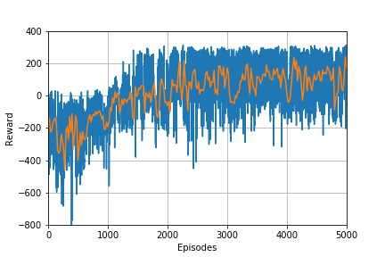
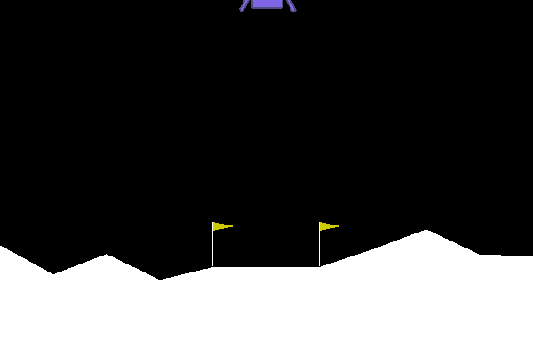
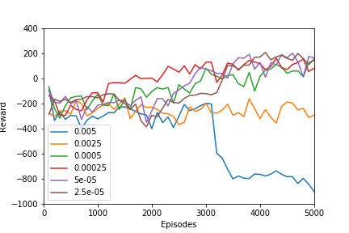
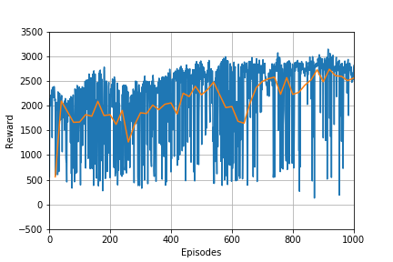
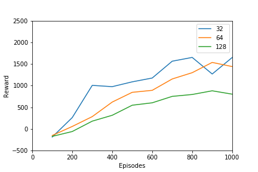
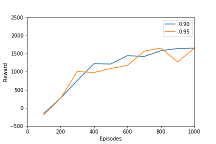
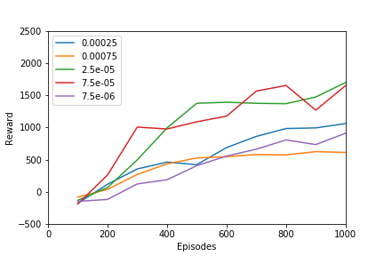

# Actor-Critic

## Project Summary:
- The homework topic was actor-critic algorithms. 
- In this project I implmented Proximal Policy Optimisation (PPO) to continuous action spaces. 
    - this model also used gradient clipping and generalised advantage estimation (GAE-$\lambda$)
- This project used OpenAI gym to make the environment cheetah 
    - to ensure the model was learning I tested it initially on LunarLander

## Files:
- Actor-Critic.ipynb - code for the PPO algorithm
- Images - training images
- Reward_Files - reward training data
- Models - training weights
    
## Training: 

### LunarLanderContinuous-v2

- The model took 1000 episodes to show that is was learning
- The model took approximately 5000 episodes to reach a mean score of greater than 200 required to 'beat' the environment. This equated to a couple of hours on cpu.
- I also measured the the performance of the model with respect to learning rate. The model appeared insensitive to order of 10 changes in learning rate.

Plot of Rewards       |  Gif of Final Product |  Learning Rate Comparison 
:-------------------------:|:-------------------------:|:-------------------------:
  |   |  

### HalfCheetah-v3

- The model took 1000 episodes to show that is was learning.
- The model took approximately 1000 episodes to reach a mean score of greater than 2700. This appears to be in excess of the benchmark using tensorflow for a PPO stated at: https://spinningup.openai.com/en/latest/spinningup/bench.html. This took <1hr of training to reach 1000 episodes on CPU. 

Plot of Rewards       |  Gif of Final Product |  Learning Rate Comparison 
:-------------------------:|:-------------------------:|:-------------------------:
  |   |  

- I also measured the the performance of the model with respect to learning rate, lambda for the GAE and the batch size. 

# Add the Gif

Batch Size Comparison     |  Lambda Comparison  |  Learning Rate Comparison 
:-------------------------:|:-------------------------:|:-------------------------:
  |   |  

# Finish below here

## Extensions: 

## A Few Notes:
- Testing the model on a simpler environment initially was extremely helpful 
- If the model is unstable with small changes in hyperparameters it is best to revise the model 
