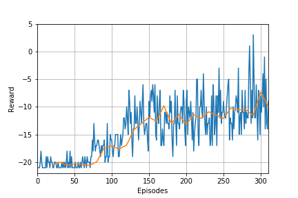
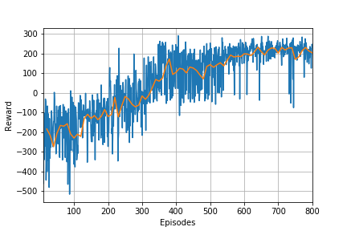
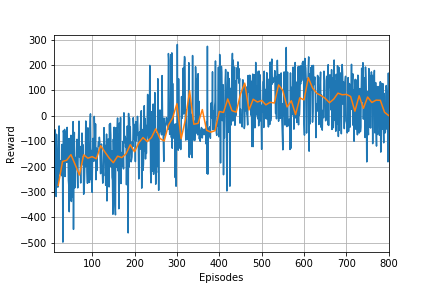

# Deep Q Network

## Project Summary:
- The homework topic was DQN algorithms. 
- In this project I implmented a DQN and a Double DQN for a discrete action space. 
    - this model also used soft target model update
- This project used OpenAI gym to make the environment LunarLander

## Files:
- DQN.ipynb - code for DQN to play pong using a CNN 
- DDQN.ipynb - code for DDQN to play lunar lander
- Images - training images
- Reward_Files - reward training data
- Models - training weights
- Replays - data saved to fill the replay
    
## Training: 

### Pong-v0

- Initially tried to use the DQN with a CNN to play pong using the image generated as the input.
- The model clearly learned and started to achieve reasonable results but learning was incredibly slow and I wasn't prepared to train the model for a week to allow me to tune the hyperparameters and reach the best results possible.
- I ran the model for approximately 20 hrs. 

Plot of Rewards       |  Gif of Final Product | 
:-------------------------:|:-------------------------:|
  |   | 

### LunarLander-v2

- The model took 200 episodes to show that it was learning.
- I used a DDQN implementation intially, but found that the model was getting stuck in local optima and declining after it had reached that point. 
- I then trained the DQN with a soft target model update and it surpassed a 100 episode average of 200 at approximately 800 episodes, beating the game. 
- The model trained every 4 time steps and updated the target model at the same instance which proved to be an efficient and effective algorithm.

Plot of Rewards for DQN    | Plot of Rewards for DDQN    |  Gif of Final Product | 
:-------------------------:|:-------------------------:|:-------------------------:|
  |   |  |

## Extensions: 
- Implement a dueling DQN. 
- Fully train the pong model.
- Extend to a more challenging environment such as Ms-Pacman.

## A Few Notes:
- I think the stability of the DQN is greater than other algorithms I have used so far, but this is counteracted by the incredibly long training time for the algorithm.
