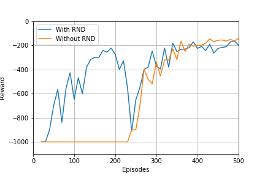
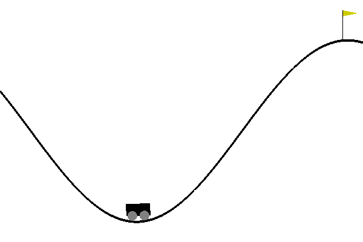

# Exploration + Offline RL

## Project Summary:
- The homework topic was algorithms to improve exploration and utilise conservative Q-learning (CQL) for offline learning.
- In this project I implmented Random Network Distillation with a DQN for a discrete action space. 
- This project used OpenAI gym to make the environment Mountain Car.

## Files:
- DQN-with-RND.ipynb - code for RS for the pendulum
- Model-Based-Reacher.ipynb - ccode for RS for the reacher
- Images - training images
- Results - reward training data
- Models - training weights
- Replays - data saved to fill the replay
    
## Training: 

### MountainCar-v0

- I used the code from the previous HW using DQNs and added RND to the training process.
- This extension was relatively easy to include and it made a significant difference with training. 
- I filled the replay buffer before hand with data collected using a random policy. 
- The buffer took about 1 hour to fill.
- The inclusion of RND leads to the model increasing from baseline significantly earlier than without, as can be seen by the figure below.

Plot of Rewards    | Gif of Final Product   | 
:-------------------------:|:-------------------------:|
  |   | 

### Conservative Q Learning

- I had intended to implement CQL for offline learning, but I found this very challenging as the technique is so new and the only code available online is that of which CQL was originally demonstrated with. Furthermore, I was eager to finish the HW so that I could start developing my PhD project. 

## Extensions: 
- Improve CQL with: https://arxiv.org/abs/2006.04779.
- Extend the RND model to a harder environment such as the custom environments used in the HWs. 
- Implement your own exploration strategy and compare to RND. 

## A Few Notes:
- I think this technique is a powerful tool for future projects where significant exploration may be required and it is very easy to implement.