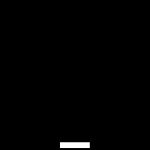

# Imitation Learning 

## Project Summary:
- The homework topic was imitation learning with a second task using data aggregation
- This project used PLE and pygame to make the environment catcher

## Files:
- Behavioural Cloning.ipynb -> code for basic imitation learning 
- Data Aggregation.ipynb -> code for basic imitation learning + dagger implementation (programmed policy improver + user data)
- Objects.ipynb -> game objects
- Utils.ipynb -> useful functions
- Game.ipynb -> game environment
- Images -> training images
- Expert Data -> the data collected to train both iterations of the model. Perfect data used bot as policy expert 
- Weights -> model weights
    - model_imitation_1hr.h5 -> model after training behavioural cloning for ~ 1hr
    - model_imitation_dag.h5 -> model with dag implementation after 3 iterations
    - model_imitation_dag_1.h5 -> previous model had bias to right, this corrected that

## Training: 
- The behavioural cloning took 1hr of training data to work flawlessly
- The data aggregation model took 3 episodes to play flawlessly

  Gif of Final Product     | 
:-------------------------:|
  |

## A Few Notes:
- Differences in human and robotic policy maker led to problems in getting the highest scores, would want to keep to one or the other
- Keeping samples constant between classes only worked if left and right had the same weighting, otherwise would be constantly pulled to one side
