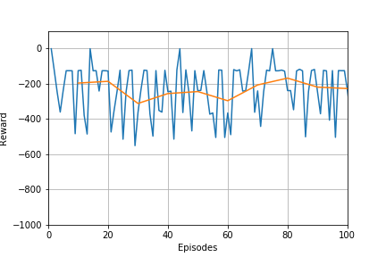
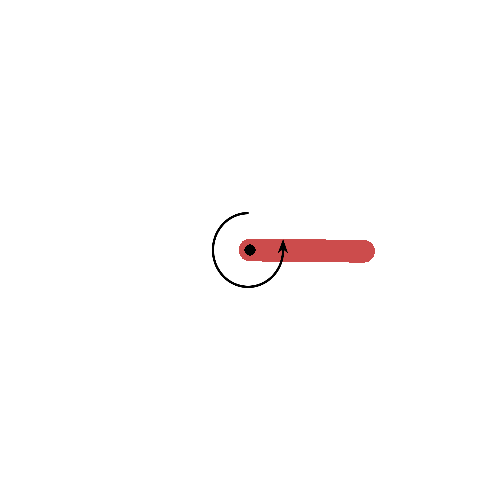
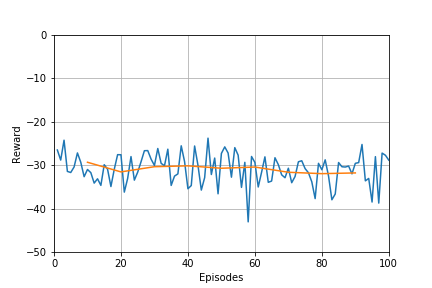
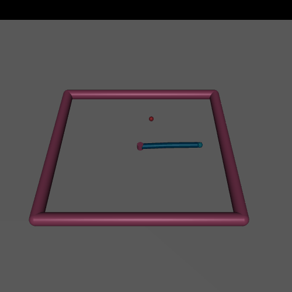

# Model-Based

## Project Summary:
- The homework topic was Model Based Algorithms algorithms, more specifically the random shooting (RS) algorithm.
- In this project I implmented an RS for a continuous action space. 
- This project used OpenAI gym to make the environment Pendulum and Reacher.

## Files:
- Model-Based-Pendulum.ipynb - code for RS for the pendulum
- Model-Based-Reacher.ipynb - ccode for RS for the reacher
- Images - training images
- Results - reward training data
- Models - training weights
- Replays - data saved to fill the replay
    
## Training: 

### Pendulum-v0

- Initially I used the pendulum environment to confirm learning. I collected a replay buffer of random actions and then started training the algorithm.
- The algorithm immediately mastered the environment when training started. As a result, the plot of rewards is less interesting than in previous HWs.
- I ran the model for approximately 1 hr to fill the replay buffer. 

Plot of Rewards       |  Gif of Final Product | 
:-------------------------:|:-------------------------:|
  |   | 

### Reacher-v2

- I had great difficulty trying to get the algorithm to solve this environment. 
- As before I filled the replay buffer before hand, but this time I used a factor of 10 times larger replay buffer.
- Regardless of the hyperparameter combination I chose the algorithm never achieved great success. 
- I also utilised several neural networks to predict the dynamics and averaged over their output, but this led to no obvious improvement.
- I believe this was the limit of the algorithm's ability as supported by the paper: https://www.cs.toronto.edu/~tingwuwang/mbrl.pdf. In this paper the RS algorithm achieved a score of -25 when trained on 20 CPUs, which is not significantly better than my algorithm performed.
- The buffer took about 2 hours to fill.
- I have included the graph and gif for completeness, as before they are not particuarly interesting.

Plot of Rewards    | Gif of Final Product   | 
:-------------------------:|:-------------------------:|
  |   | 

### HalfCheetah-v2

- I had intended on testing the algorithm on the halfcheetah, but it was lacking in the less complex reacher environment and the HW didn't cover any more powerful algorithms so I didn't think it was worth it.

## Extensions: 
- Improve the RS with: https://arxiv.org/pdf/1909.11652.pdf.
- Implement some of the more powerful model based algorithms from the paper: https://www.cs.toronto.edu/~tingwuwang/mbrl.pdf.

## A Few Notes:
- This algorithm did prove very powerful and sample efficient for the pendulum task and therefore it may be useful for other simple environments with small action spaces. 