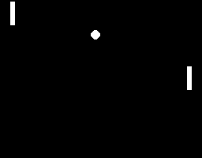

# Policy Gradients

## Project Summary:
- The homework topic was policy gradients including the application of techniques such as reward-to-go, discounted reward & baselines
- In this project I implmented the Minimal Monte Carlo Policy Gradient (REINFORCE) Algorithm
    - this model uses reward-to-go & discounted reward, but not baselines
- This project used PLE and pygame to make the environment Pong
    - to ensure the model was learning I tested it initially on Catcher

## Files:
- Policy_Gradient_Model_v1.ipynb - code for REINFORCE algorithm
- Policy_Gradient_Model_v2.ipynb - code for REINFORCE algorithm + shuffling data
- Policy_Gradient_Model_v3.ipynb - code for REINFORCE algorithm using an altered loss function
- Pong_Game.ipynb - the game loop for running v1 and v2
- Utils.ipynb - useful functions
- Game.ipynb - game environment
- Images - training images
- Reward_Files - reward training data
- Weights - training weights
    - PG_catcher_v3_1000.h5 - weights after training v3 on catcher for 1000 episode
    - PG_pong_v3_5000.h5 - weights after training v3 on pong for 5000 episode
    - PG_pong_v3_12500.h5 - weights after training v3 on pong for 5000 episode
    
## Training: 
- The model took 1000 episodes to show that is was learning
- The model took approximately 9000 episodes to win 50% of games

Plot of Rewards       |  Gif of Final Product (left)
:-------------------------:|:-------------------------:
  |  

## Extensions: 
- Implement a replay buffer
- Implement a state-dependent baseline using a NN
- Implement GAE-lambda advantage estimation
- Expand the model to win a greater percentage of the games

## A Few Notes:
- Testing the model on a simpler environment initially was extremely helpful 
- If the model is unstable with small changes in hyperparameters it is best to revise the model 

